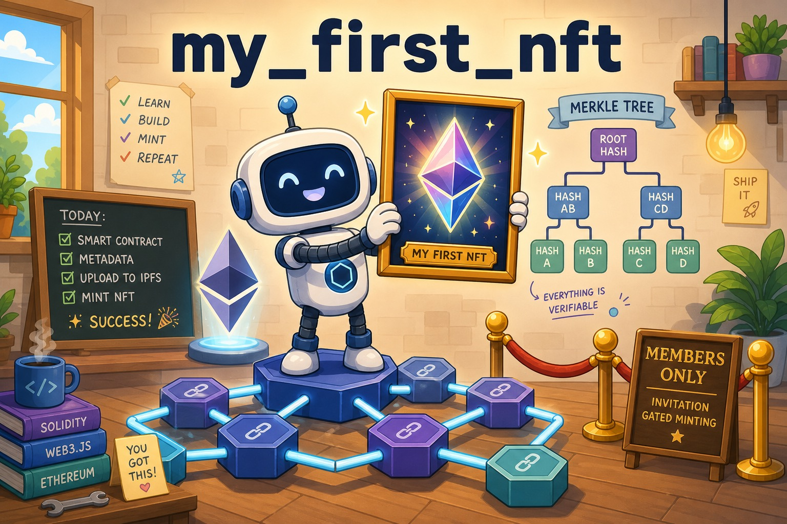

# my_first_nft

   



A learning playground (2022) for writing and testing ERC-721 NFT smart contracts with Truffle and OpenZeppelin. It explores several minting patterns — invitation-based membership, supply-limited minting, Merkle-proof whitelists, and upgradeable proxy contracts — each with a deployment migration and a test suite.

## Contracts

All contracts live under `contracts/artifacts/nfts/` and target Solidity `<0.9.0` (compiled with 0.8.13):

- **InvitationMembershipNFT** — ERC-721 where the owner or any existing token holder can mint and transfer a new membership token (`onlyOwnerOrMember` modifier)
- **LimitedInvitationMembershipNFT** — same invitation pattern with a capped supply
- **WhitelistNFT** — Merkle-proof gated minting (`merkletreejs` + `keccak256` build the tree off-chain; `MerkleProof.verify` checks on-chain), one claim per address
- **UpgradeableNFT_V1 / V2** — upgradeable ERC-721 via OpenZeppelin's upgradeable contracts and `@openzeppelin/truffle-upgrades`, demonstrating an initialize-then-upgrade flow

## Requirements

- Node.js with Yarn (`yarn.lock` present)
- Truffle ^5.5.12
- A local Ethereum node on `127.0.0.1:7545` (e.g. Ganache) — the only configured network is `development`

## Usage

```bash
yarn install
truffle compile
truffle migrate   # runs migrations 1–5 against the local node
truffle test      # mocha tests with eth-gas-reporter (gas costs in JPY)
```

## Project Structure

```
contracts/
  Migrations.sol
  artifacts/nfts/        # the five NFT contracts
migrations/              # deploy scripts, incl. proxy deploy & upgrade
test/                    # truffle-assertions based test suites
truffle-config.js        # solc 0.8.13, Ganache dev network, gas reporter
```

## Status

A personal learning project from May 2022. Dependencies (OpenZeppelin 4.x, Truffle — now sunset) are dated; treat this as reference material rather than a production template.
